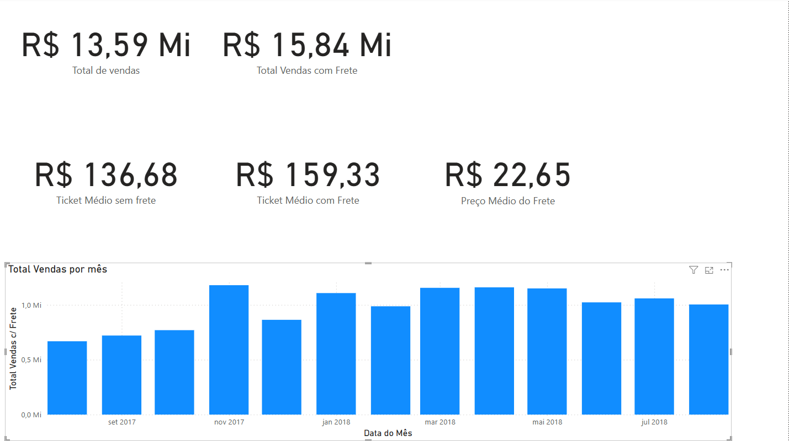

## 📊 Dashboard Power BI - Olist
Aqui está uma prévia do dashboard criado:

Este repositório contém um dashboard interativo no Power BI baseado no dataset da Olist, uma plataforma de e-commerce brasileira.

📌 Objetivo: Criar uma análise de vendas, avaliando o desempenho dos pedidos, faturamento, fretes e avaliações de clientes.
🚀 Tecnologias Utilizadas

    Power BI: Construção do dashboard.
    SQL / SQLite: Extração dos dados da Olist.
    DAX: Cálculos e medidas personalizadas.

📂 Dataset

O conjunto de dados foi retirado do Kaggle. Ele contém informações sobre pedidos, clientes, vendedores e produtos.

As principais tabelas utilizadas foram:

    orders (Pedidos)
    order_items (Itens dos pedidos)
    customers (Clientes)
    order_reviews (Avaliações)
    order_payments (Pagamentos)
    sellers (Vendedores)
    geolocation (Localização dos clientes)

📈 Principais Análises

    Vendas Totais (com e sem frete)
    Ticket Médio
    Vendas por Mês (Últimos 12 meses)
    Custo Médio do Frete
